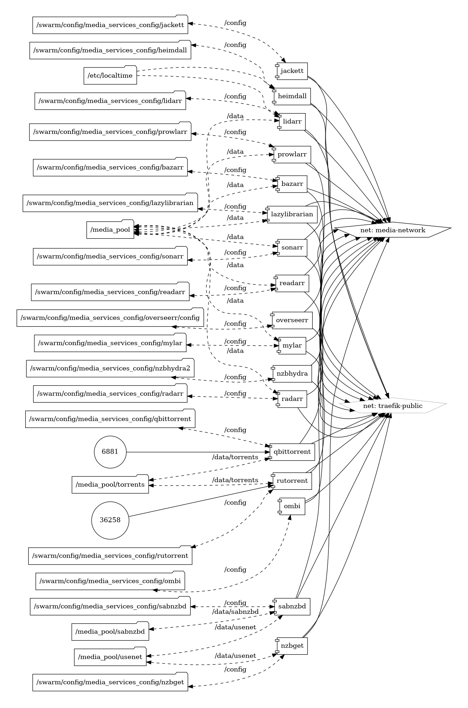

Your Comprehensive Resource Hub / All-in-One Self-Hosted Media Stack

{ loading=lazy }

## What is Servarr?

Servarr represents a family of open-source applications dedicated to automating and enhancing the management of media content, spanning movies, TV shows, music, and literature. Whether you're seeking an automated movie collection with Radarr, a TV show organizer with Sonarr, a music library manager with Lidarr, or a literature catalog with Readarr, Servarr has you covered.

## Key Features of Servarr Wiki

- **Comprehensive Guides:** The Servarr Wiki hosts detailed guides, tutorials, and documentation to assist users in the installation, configuration, and optimization of various Servarr applications.

- **Community Contributions:** Benefit from a wealth of community-driven content, tips, and troubleshooting solutions shared by Servarr users and enthusiasts.

- **Official Documentation:** Access official documentation for each Servarr project, ensuring accurate and up-to-date information straight from the developers.

## Getting Started

Navigate the [Servarr Wiki](https://wiki.servarr.com/) to explore a plethora of resources tailored to your specific Servarr project. Whether you're a novice or an experienced user, the wiki provides a user-friendly interface and organized structure for easy navigation.

## Community and Support

Connect with the vibrant Servarr community through the [Github repository](https://github.com/Servarr/Wiki) to engage in discussions, seek assistance, and share your experiences. Stay connected with the latest updates, announcements, and collaborative efforts within the Servarr ecosystem.

Discover the full potential of your media management journey with Servarr and the wealth of knowledge curated in the Servarr Wiki.
