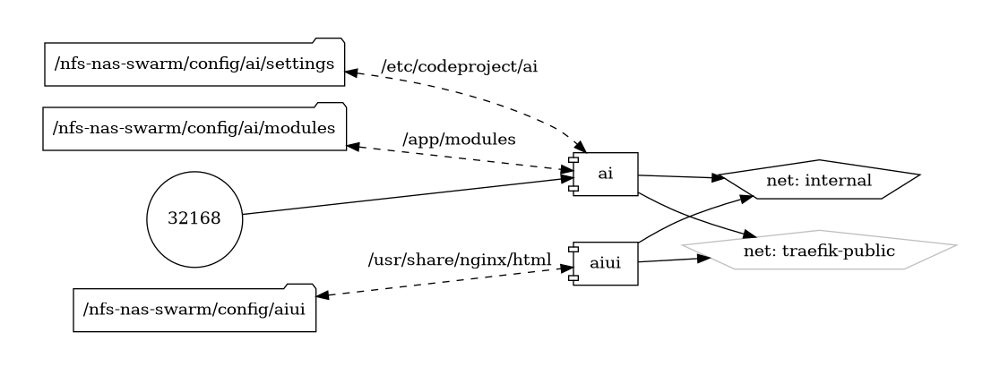

# AI Server

<!-- ## CodeProject.AI Server:Empowering AI and Machine Learning at Your Fingertips -->

{ loading=lazy }

[CodeProject.AI Server](https://github.com/CodeProject/AI-Server) is a powerful and versatile platform designed to facilitate the deployment, management, and scaling of AI and machine learning models. Developed by CodeProject, this open-source server aims to democratize access to advanced AI capabilities, making it easier for developers, researchers, and businesses to integrate intelligent features into their applications.

## Key Features

- **Easy Deployment:** Simplify the deployment of AI models with a server designed to handle the complexities of machine learning infrastructure.

- **Scalability:** Effortlessly scale your AI workloads to meet growing demands, ensuring that your applications remain responsive and efficient.

- **Extensible:** CodeProject.AI Server supports a wide range of AI and machine learning frameworks, allowing you to integrate the tools and libraries that best suit your needs.

- **Community-Driven:** Benefit from a vibrant community of contributors and users who share their knowledge, tools, and best practices.

## Getting Started

Kickstart your journey with CodeProject.AI Server by visiting the [official GitHub repository](https://github.com/CodeProject/AI-Server). The repository includes comprehensive documentation, installation guides, and example projects to help you get up and running quickly.

## Community and Support

Join the CodeProject.AI Server community on [GitHub](https://github.com/CodeProject/AI-Server) to engage in discussions, seek support, and contribute to the project. Stay informed about the latest updates, features, and improvements through active community participation.

Discover the potential of AI and machine learning with CodeProject.AI Server—a platform designed to bring advanced intelligence to your fingertips.


## Volumes

```bash
/nfs-nas-swarm/config/
/nfs-nas-swarm/data/
```

## Deployment
No Special requirments

## Docker swarm file
``` yaml linenums="1" 
--8<-- "/docs/github-repos/portainer-compose/stacks/ai.yml"
```

## Notes

