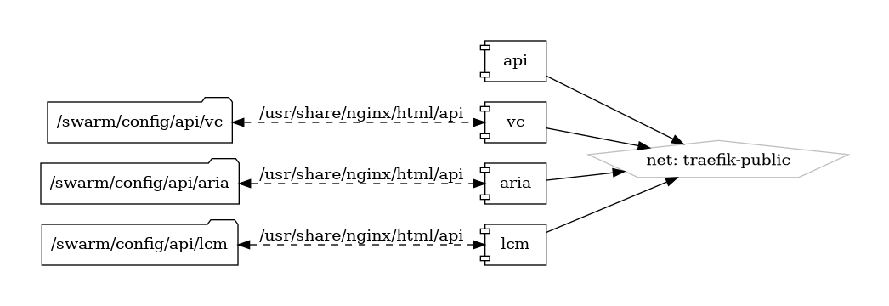

# API's (Swagger)

Simplifying API Development and Documentation

{ loading=lazy }

[Swagger](https://swagger.io/) is an open-source framework designed to aid in the development, design, documentation, and consumption of RESTful web services. By providing a suite of tools and an established specification, Swagger streamlines the creation and management of APIs, making it easier for developers to build and maintain robust and well-documented APIs.

## Key Features

- **OpenAPI Specification:** Swagger leverages the OpenAPI Specification (OAS), a standard format for describing REST APIs, ensuring consistency and compatibility across different tools and platforms.
- **Interactive API Documentation:** With Swagger UI, developers can generate interactive, web-based documentation for their APIs, allowing for easy exploration and testing of API endpoints.
- **API Design and Development:** Tools like Swagger Editor and SwaggerHub facilitate the design and development process, enabling collaboration and seamless integration with development workflows.
- **Code Generation:** Swagger Codegen allows for the automatic generation of client libraries, server stubs, and API documentation in various programming languages, speeding up development and ensuring consistency.
- **Community and Ecosystem:** Swagger boasts a vibrant community and a rich ecosystem of tools and integrations, enhancing its capabilities and ensuring continuous improvement.

## Getting Started

To get started with Swagger, visit the [official Swagger website](https://swagger.io/) and explore the comprehensive documentation, tutorials, and resources available. The Swagger Editor and SwaggerHub provide intuitive platforms for designing and documenting your APIs.

## Community and Support

Join the Swagger community through the [Swagger GitHub repository](https://github.com/swagger-api) to engage with other users, contribute to the project, and stay informed about the latest updates and features. The active community ensures robust support and continuous innovation.

Experience the efficiency and clarity of API development with Swagger—a framework designed to simplify and enhance the entire lifecycle of your APIs.


## Volumes

```bash
/swarm/config/
/swarm/data/
```

## Deployment
No Special requirments

## Docker swarm file
``` yaml linenums="1" 
--8<-- "/docs/github-repos/portainer-compose/stacks/api.yml"
```

## Notes

