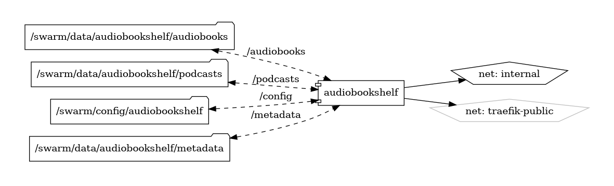

# Audiobookshelf

Your Personal Audiobook Library

{ loading=lazy }

[Audiobookshelf](https://github.com/advplyr/audiobookshelf) is an open-source, self-hosted application designed to organize, stream, and manage your audiobook collection. With a focus on ease of use and accessibility, Audiobookshelf provides a seamless listening experience, allowing you to enjoy your audiobooks from anywhere.

## Key Features

- **Self-Hosted Solution:** Take control of your audiobook library by hosting Audiobookshelf on your own server, ensuring privacy and customization.
- **User-Friendly Interface:** Enjoy a clean and intuitive web interface for managing and listening to your audiobooks, designed for simplicity and ease of use.
- **Cross-Platform Streaming:** Access your audiobooks from any device with a web browser, including desktops, tablets, and smartphones.
- **Metadata Management:** Automatically fetch metadata, including cover art, descriptions, and author information, to keep your library well-organized.
- **Bookmarks and Progress Tracking:** Save your progress and bookmarks across different devices, ensuring a continuous and enjoyable listening experience.

## Getting Started

To get started with Audiobookshelf, visit the [official GitHub repository](https://github.com/advplyr/audiobookshelf) for installation instructions, configuration guides, and additional resources. Whether you're deploying on a local server or a cloud environment, the documentation provides step-by-step guidance for a smooth setup.

## Community and Support

Join the Audiobookshelf community on [GitHub](https://github.com/advplyr/audiobookshelf) to engage with other users, share feedback, and contribute to the project. Stay informed about the latest updates, new features, and community-driven enhancements.

Transform your audiobook collection into a personalized, accessible library with Audiobookshelf—a powerful tool for audiobook enthusiasts.


## Volumes

```bash
/swarm/config/
/swarm/data/
```

## Deployment
No Special requirments

## Docker swarm file
``` yaml linenums="1" 
--8<-- "/docs/github-repos/portainer-compose/stacks/audiobookshelf.yml"
```

## Notes

