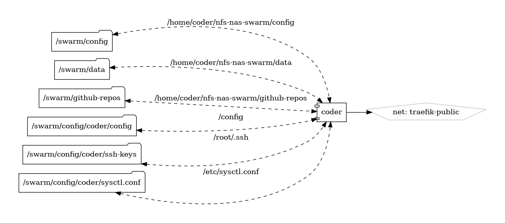

# Coder

Revolutionizing Development Environments

{ loading=lazy }

[Coder](https://coder.com/) is a cutting-edge platform that revolutionizes the way developers create, collaborate, and deploy applications. With a focus on simplicity and efficiency, Coder provides a cloud-based development environment that empowers teams to code securely and collaboratively from anywhere in the world.

## Key Features

- **Cloud-Native Development:** Coder allows developers to access their development environments from the cloud, eliminating the need for complex local setups and ensuring consistency across team members.

- **Collaboration Tools:** Enhance teamwork with collaborative features that enable real-time code sharing, pair programming, and seamless communication within the development environment.

- **Security First:** Coder prioritizes security by providing secure and isolated development environments, ensuring that code and data are protected throughout the development lifecycle.

- **Scalability:** Whether you're a solo developer or part of a large enterprise, Coder scales effortlessly to meet your team's needs, providing a flexible and adaptable development environment.

## Getting Started

Embark on a new era of development with Coder by exploring the platform's features and capabilities. The [official Coder website](https://coder.com/) offers detailed documentation, tutorials, and resources to help you get started quickly.

## Community and Support

Join the Coder community to connect with fellow developers, share insights, and seek assistance. Stay informed about updates, new features, and best practices through community forums and official channels.

Experience the future of collaborative and cloud-native development with Coder—a platform designed to transform the way you code and build software.


## Volumes

```bash
/swarm/config/coder
/swarm/config
```

## Deployment
No Special requirments

## Docker swarm file
``` yaml linenums="1" 
--8<-- "/docs/github-repos/portainer-compose/stacks/coder.yml"
```

## Notes

