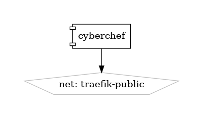

# CyberChef

The Cyber Swiss Army Knife

{ loading=lazy }

[CyberChef](https://gchq.github.io/CyberChef/) is a powerful and intuitive web-based tool designed to perform a wide range of data processing and analysis tasks. Often referred to as the "Cyber Swiss Army Knife," CyberChef allows users to manipulate data through an extensive collection of operations, all within a user-friendly drag-and-drop interface. Developed by GCHQ, CyberChef is invaluable for cybersecurity professionals, developers, and data analysts.

## Key Features

- **Versatile Data Processing:** Perform a multitude of operations, such as encryption, encoding, compression, data conversion, and more, all in one place.
- **User-Friendly Interface:** Utilize a drag-and-drop interface to create complex recipes for data manipulation without needing to write code.
- **Real-Time Processing:** See the results of your operations in real-time, making it easy to experiment and refine your data transformations.
- **Extensive Operation Library:** Access a vast collection of built-in operations, each with detailed documentation and usage examples.
- **Open Source:** CyberChef is open-source software, ensuring transparency, security, and community-driven improvements.

## Getting Started

To start using CyberChef, visit the [official CyberChef website](https://gchq.github.io/CyberChef/). The website offers an interactive environment where you can immediately begin processing data. For more in-depth information, tutorials, and examples, explore the [documentation](https://gchq.github.io/CyberChef/#help).

## Community and Support

Engage with the CyberChef community on [GitHub](https://github.com/gchq/CyberChef) to report issues, request features, and contribute to the project. Stay informed about the latest updates and enhancements driven by an active community of users and developers.

Discover the power and flexibility of data manipulation with CyberChef—the ultimate tool for all your data processing needs.


## Volumes

```bash
/swarm/config/
/swarm/data/
```

## Deployment
No Special requirments

## Docker swarm file
``` yaml linenums="1" 
--8<-- "/docs/github-repos/portainer-compose/stacks/cyberchef.yml"
```

## Notes

