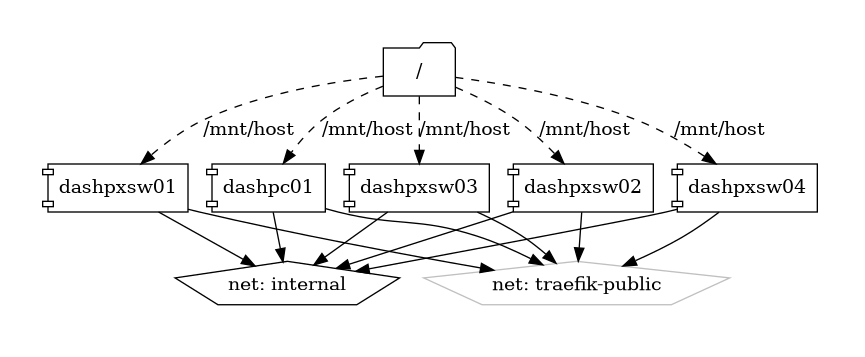

# Dashdot

Real-Time Server Monitoring Dashboard

{ loading=lazy }

[Dashdot](https://github.com/MauriceNino/dashdot) is an elegant and customizable web-based dashboard designed for real-time monitoring of your server's health and performance. With its modern and intuitive interface, Dashdot provides key insights into your server's status, helping you keep track of essential metrics and ensure optimal performance.

## Key Features

- **Real-Time Monitoring:** Track your server's CPU, memory, disk usage, and network activity in real-time, ensuring you always have up-to-date information.
- **User-Friendly Interface:** Enjoy a sleek and intuitive dashboard that makes it easy to visualize and understand your server's performance metrics.
- **Customization:** Tailor the dashboard to your needs with customizable widgets and themes, allowing you to focus on the metrics that matter most.
- **Open Source:** Dashdot is open-source, providing transparency, flexibility, and the ability to contribute to the project's development.

## Getting Started

To get started with Dashdot, visit the [official GitHub repository](https://github.com/MauriceNino/dashdot) for installation instructions, configuration guides, and additional resources. Whether you are deploying Dashdot on a local server or in the cloud, the repository provides comprehensive details to help you set up and customize your dashboard.

## Community and Support

Join the Dashdot community on [GitHub](https://github.com/MauriceNino/dashdot) to engage with other users, share feedback, and contribute to the project. Stay informed about the latest features, improvements, and community-driven enhancements.

Monitor your server's performance effortlessly with Dashdot—a powerful and customizable dashboard designed to keep your server running smoothly.


## Volumes

```bash
/swarm/config/
/swarm/data/
```

## Deployment
No Special requirments

## Docker swarm file
``` yaml linenums="1" 
--8<-- "/docs/github-repos/portainer-compose/stacks/dashdot.yml"
```

## Notes

