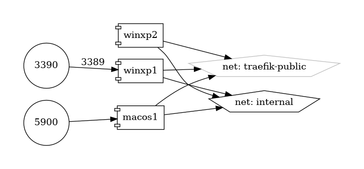

# Dockur Windows

## Introduction

Windows machine in docker container.

{ loading=lazy }


## Volumes

```bash
/nfs-nas-swarm/config/
/nfs-nas-swarm/data/
```

## Deployment
No Special requirments

## Docker swarm file
``` yaml linenums="1" 
--8<-- "/docs/github-repos/portainer-compose/stacks/windows.yml"
```

## Notes

