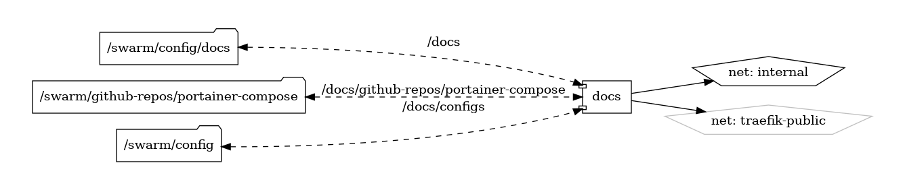

# MkDocs

Simplified Documentation with Markdown

{ loading=lazy }

[MkDocs](https://www.mkdocs.org/) stands as a versatile and user-friendly documentation tool that transforms simple Markdown files into elegant and responsive websites. Developed with simplicity and ease of use in mind, MkDocs empowers individuals and teams to create professional-looking documentation without the need for complex configurations or technical expertise.

## Key Features

- **Markdown-Based:** MkDocs leverages the simplicity of Markdown, allowing users to focus on content creation without the need for intricate markup or coding.

- **Built-In Theming:** Choose from a variety of built-in themes to give your documentation a polished and professional appearance effortlessly.

- **Customization:** Tailor your documentation site with custom themes, plugins, and configurations to match your branding and requirements.

- **Responsive Design:** MkDocs generates documentation with a responsive design, ensuring an optimal reading experience on various devices.

## Getting Started

Embark on your documentation journey with MkDocs by following the straightforward setup and configuration steps outlined in the [official documentation](https://www.mkdocs.org/). Whether you're a developer, writer, or team lead, MkDocs simplifies the process of creating and maintaining documentation.

## Community and Support

Connect with the MkDocs community on [GitHub](https://github.com/mkdocs/mkdocs) to engage in discussions, report issues, and stay informed about updates. The collaborative nature of MkDocs ensures a supportive environment for users at all levels of expertise.

Experience the power of streamlined documentation creation with MkDocs, where Markdown meets elegance.


## Volumes

```bash
/nfs-nas-swarm/data/docs
```

## Deployment

First you should create a config file "mkdocs.yml" on the shared volume.

```bash
nano /nfs-nas-swarm/config/docs/mkdocs.yml
theme:
  name: 'material'
```

you can grab a default config file by deploying a temp container

```bash
docker run --rm -it -p 8000:8000 -v /nfs-nas-swarm/config/docs:/docs squidfunk/mkdocs-material 
```

## Docker swarm file
``` yaml linenums="1" 
--8<-- "/docs/github-repos/portainer-compose/stacks/docs.yml"
```


## Notes

