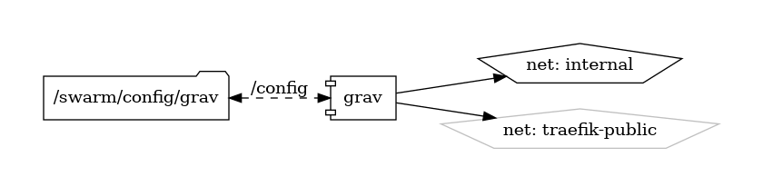

# Grav

Fast, Simple, and Flexible Flat-File CMS

{ loading=lazy }

[Grav](https://getgrav.org/) is a modern open-source flat-file CMS (Content Management System) built on PHP that requires no database. With its lightweight architecture, flexible design, and powerful features, Grav offers developers and content creators a fast and intuitive platform for building websites, blogs, and web applications.

## Key Features

- **Flat-File Structure:** Grav uses a file-based structure instead of a traditional database, making it easy to manage and deploy without the need for complex server setups.
- **Fast and Lightweight:** Grav's minimalistic approach results in fast page load times and efficient resource utilization, ideal for performance-oriented websites and applications.
- **Twig Templating:** Leveraging the Twig templating engine, Grav offers a flexible and powerful templating system for creating custom themes and layouts.
- **Modular Architecture:** Extend Grav's functionality with a wide range of plugins and themes available through the built-in package manager, enabling customization and scalability.
- **Developer-Friendly:** Grav's modular architecture and well-documented API make it easy for developers to extend and customize the platform to suit their specific requirements.

## Getting Started

To get started with Grav, download and install the core files from the [official website](https://getgrav.org/). The website provides comprehensive documentation, tutorials, and guides to help you set up and configure Grav for your website or project.

## Community and Support

Join the Grav community on the [official forums](https://discourse.getgrav.org/) to engage with other users, ask questions, share your projects, and contribute to the project. Stay informed about the latest updates, features, and best practices through community discussions and announcements.

Experience the simplicity and flexibility of Grav—a modern flat-file CMS designed to streamline website development and content management.


## Volumes

```bash
/nfs-nas-swarm/config/
/nfs-nas-swarm/data/
```

## Deployment
No Special requirments

## Docker swarm file
``` yaml linenums="1" 
--8<-- "/docs/github-repos/portainer-compose/stacks/grav.yml"
```

## Notes

