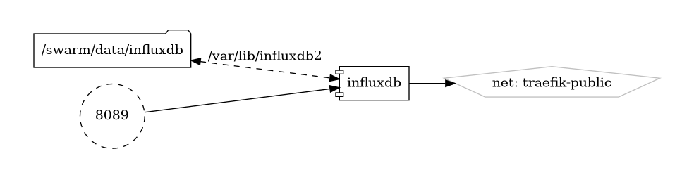

# InfluxDB

Scalable Time-Series Database

{ loading=lazy }

[InfluxDB](https://www.influxdata.com/products/influxdb-overview/) is an open-source time-series database designed to handle high write and query loads, making it ideal for storing and analyzing time-series data from various sources such as sensors, application metrics, and IoT devices. With its powerful query language, scalable architecture, and integrations with popular data visualization tools, InfluxDB enables users to gain valuable insights into their time-series data.

## Key Features

- **Time-Series Data Model:** InfluxDB is optimized for handling time-series data, with built-in support for timestamps and tags, allowing for efficient storage and retrieval of time-stamped data points.
- **Scalable Architecture:** InfluxDB's architecture is designed to scale horizontally, enabling users to handle large volumes of time-series data with ease.
- **Flexible Query Language:** InfluxQL, InfluxDB's query language, provides powerful capabilities for querying and analyzing time-series data, including aggregation functions, filtering, and downsampling.
- **Integration Ecosystem:** InfluxDB integrates seamlessly with a variety of data sources and visualization tools, including Grafana, Prometheus, and Telegraf, enabling users to build end-to-end monitoring and analytics solutions.
- **High Availability:** InfluxDB Enterprise offers features such as clustering and data replication to ensure high availability and data durability for mission-critical applications.

## Getting Started

To get started with InfluxDB, download and install the software from the [official website](https://www.influxdata.com/products/influxdb-overview/), or deploy it using Docker or Kubernetes. The website also offers comprehensive documentation, tutorials, and guides to help you set up and configure InfluxDB for your specific use case.

## Community and Support

Join the InfluxDB community on the [official forums](https://community.influxdata.com/) to engage with other users, ask questions, share your projects, and contribute to the project. Stay informed about the latest updates, features, and best practices through community discussions and announcements.

Unlock the power of time-series data analysis with InfluxDB—a scalable and versatile database designed for storing and querying time-stamped data.


## Volumes

```bash
/nfs-nas-swarm/config/
/nfs-nas-swarm/data/
```

## Deployment
No Special requirments

## Docker swarm file
``` yaml linenums="1" 
--8<-- "/docs/github-repos/portainer-compose/stacks/influxdb.yml"
```

## Notes

