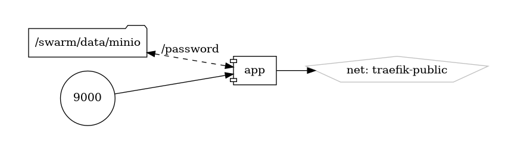

# MinIO

High Performance Object Storage

{ loading=lazy }

[MinIO](https://min.io/) is a high-performance, open-source object storage system designed for cloud-native and containerized environments. It provides an S3-compatible API that allows developers to store and retrieve unstructured data, such as photos, videos, backups, and log files, with scalability, durability, and security. With its lightweight and easy-to-deploy architecture, MinIO is ideal for building scalable data infrastructure for modern applications.

## Key Features

- **S3-Compatible API:** MinIO implements the Amazon S3 API, allowing seamless integration with existing S3-compatible applications and tools.
- **High Performance:** MinIO is optimized for high throughput and low latency, making it suitable for use cases that require fast data access and retrieval.
- **Scalability:** MinIO supports horizontal scaling, enabling users to add more nodes to their cluster to accommodate growing data volumes and workloads.
- **Data Protection:** MinIO offers features such as erasure coding, encryption, and versioning to protect data integrity and confidentiality.
- **Multi-Tenancy:** MinIO supports multi-tenancy, allowing users to create isolated buckets and access policies for different applications and users.

## Getting Started

To get started with MinIO, download and install the software from the [official website](https://min.io/), or deploy it using Docker, Kubernetes, or other container orchestration platforms. The website provides comprehensive documentation, tutorials, and guides to help you set up and configure MinIO for your specific use case.

## Community and Support

Join the MinIO community on [GitHub](https://github.com/minio/minio) to engage with other users, ask questions, share your projects, and contribute to the project. Stay informed about the latest updates, features, and best practices through community discussions and announcements.

Empower your applications with scalable and high-performance object storage using MinIO—a powerful and versatile solution for modern data infrastructure.


## Volumes

```bash
/nfs-nas-swarm/config/
/nfs-nas-swarm/data/
```

## Deployment
No Special requirments

## Docker swarm file
``` yaml linenums="1" 
--8<-- "/docs/github-repos/portainer-compose/stacks/minio.yml"
```

## Notes

