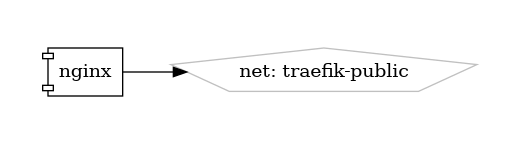

# Nginx

High-Performance Web Server and Reverse Proxy

{ loading=lazy }

[Nginx](https://www.nginx.com/) is a high-performance web server, reverse proxy, and load balancer known for its speed, scalability, and reliability. Widely used by web developers and system administrators, Nginx is capable of handling large volumes of concurrent connections while consuming minimal system resources. It excels in serving static content, handling dynamic requests, and efficiently distributing incoming traffic across multiple servers.

## Key Features

- **High Performance:** Nginx is designed to deliver exceptional performance and low-latency responses, making it ideal for high-traffic websites and applications.
- **Reverse Proxy:** Nginx can act as a reverse proxy, forwarding requests from clients to backend servers, and delivering responses back to clients, enhancing security and performance.
- **Load Balancing:** Nginx provides built-in load balancing capabilities, enabling distribution of incoming traffic across multiple servers to optimize resource utilization and maintain application availability.
- **SSL/TLS Termination:** Nginx supports SSL/TLS termination, allowing it to handle encryption and decryption of HTTPS traffic, enhancing security and offloading SSL processing from backend servers.
- **Flexible Configuration:** Nginx offers a flexible and powerful configuration language, allowing users to define complex routing rules, URL rewriting, caching policies, and more.

## Getting Started

To get started with Nginx, download and install the software from the [official website](https://www.nginx.com/), or use pre-built packages available for various Linux distributions. The website provides comprehensive documentation, tutorials, and guides to help you set up and configure Nginx for your specific use case.

## Community and Support

Join the Nginx community on [GitHub](https://github.com/nginx/nginx) to engage with other users, ask questions, share your projects, and contribute to the project. Stay informed about the latest updates, features, and best practices through community discussions and announcements.

Harness the power and performance of Nginx—a versatile and reliable web server and reverse proxy for building scalable and resilient web applications.


## Volumes

```bash
/swarm/config/
/swarm/data/
```

## Deployment
No Special requirments

## Docker swarm file
``` yaml linenums="1" 
--8<-- "/docs/github-repos/portainer-compose/stacks/nginx.yml"
```

## Notes

