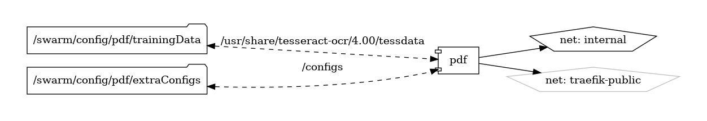

# sPDF

Simple PDF Generation Service

{ loading=lazy }

[sPDF](https://github.com/frooodle/s-pdf) is a lightweight and simple PDF generation service designed to convert HTML content into PDF documents. Built with ease of use and simplicity in mind, sPDF provides a convenient way to generate PDFs from HTML templates or web pages programmatically or through a user-friendly interface.

## Key Features

- **HTML to PDF Conversion:** sPDF converts HTML content, including CSS styles and JavaScript, into PDF documents, preserving the layout and formatting of the original content.
- **RESTful API:** sPDF offers a RESTful API that allows developers to generate PDFs programmatically by sending HTML content as a request payload.
- **User-Friendly Interface:** sPDF provides a web-based interface for generating PDFs interactively, enabling users to input HTML content, customize settings, and download the resulting PDFs.
- **Customization Options:** Customize PDF output by specifying page size, orientation, margins, headers, footers, and other settings to suit specific requirements.
- **Open-Source:** sPDF is an open-source project, providing transparency, flexibility, and community-driven development for ongoing improvements and enhancements.

## Getting Started

To get started with sPDF, deploy the sPDF service using Docker or run it locally on your machine. Visit the [official GitHub repository](https://github.com/frooodle/s-pdf) for installation instructions, configuration guides, and additional resources. The repository also provides comprehensive documentation to help you set up and customize sPDF according to your preferences.

## Community and Support

Join the sPDF community on [GitHub](https://github.com/frooodle/s-pdf) to engage with other users, share feedback, report issues, and contribute to the project. Stay informed about the latest updates, features, and community-driven enhancements through discussions and announcements.

Generate PDFs effortlessly with sPDF—a simple and versatile PDF generation service for converting HTML content into PDF documents.


## Volumes

```bash
/swarm/config/
/swarm/data/
```

## Deployment
No Special requirments

## Docker swarm file
``` yaml linenums="1" 
--8<-- "/docs/github-repos/portainer-compose/stacks/pdf.yml"
```

## Notes

