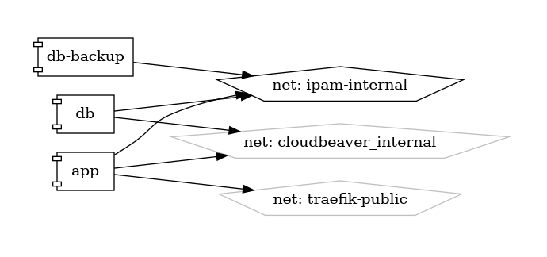

# phpIPAM

IP Address Management (IPAM) Solution

{ loading=lazy }

[phpIPAM](https://phpipam.net/) is an open-source web-based application for managing IP addresses and subnet allocations in an organization's network infrastructure. It provides a centralized platform for tracking IP address assignments, subnet configurations, DNS records, and VLANs, enabling network administrators to efficiently manage and organize their IP address space.

## Key Features

- **IP Address Management:** phpIPAM allows administrators to create, view, and manage IP addresses and subnets, including allocation, reservation, and delegation of IP addresses.
- **Subnetting:** phpIPAM supports IPv4 and IPv6 subnetting, allowing administrators to create hierarchical subnet structures and efficiently allocate IP addresses within each subnet.
- **DNS Management:** phpIPAM integrates with DNS servers to automate DNS record management, including forward and reverse DNS record creation, deletion, and synchronization.
- **VLAN Management:** phpIPAM provides tools for managing VLAN configurations, including VLAN tagging, assignment, and association with IP subnets.
- **User Authentication and Permissions:** phpIPAM offers user authentication and role-based access control (RBAC), allowing administrators to define user roles and permissions for accessing and managing IP address data.

## Getting Started

To get started with phpIPAM, download and install the software from the [official website](https://phpipam.net/), or deploy it using Docker or other containerization platforms. The website provides comprehensive documentation, tutorials, and guides to help you set up and configure phpIPAM for your network environment.

## Community and Support

Join the phpIPAM community on the [official forums](https://phpipam.net/community/) to engage with other users, ask questions, share your experiences, and contribute to the project. Stay informed about the latest updates, features, and best practices through community discussions and announcements.

Simplify IP address management in your network infrastructure with phpIPAM—an intuitive and feature-rich IP Address Management (IPAM) solution designed for network administrators.


## Volumes

```bash
/nfs-nas-swarm/config/
/nfs-nas-swarm/data/
```

## Deployment
No Special requirments

## Docker swarm file
``` yaml linenums="1" 
--8<-- "/docs/github-repos/portainer-compose/stacks/phpipam.yml"
```

## Notes

