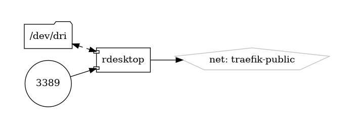

# rdesktop

Open Source Remote Desktop Protocol (RDP) Client

{ loading=lazy }

[rdesktop](https://www.rdesktop.org/) is an open-source client for the Remote Desktop Protocol (RDP), allowing users to connect to remote Windows desktops or servers from Unix-based operating systems, such as Linux and BSD. With its lightweight and efficient implementation, rdesktop provides a reliable and convenient solution for accessing remote Windows machines and applications over a network connection.

## Key Features

- **Cross-Platform Compatibility:** rdesktop is compatible with various Unix-based operating systems, including Linux, BSD, and macOS, enabling users to access remote Windows desktops and servers from diverse environments.
- **Standard RDP Protocol Support:** rdesktop supports the standard RDP protocol, allowing seamless connectivity to remote Windows machines without the need for additional proprietary software or licenses.
- **Session Persistence:** rdesktop maintains session persistence, enabling users to resume remote desktop sessions across network interruptions or disconnects.
- **Clipboard Redirection:** rdesktop supports clipboard redirection, allowing users to copy and paste text, files, and other data between the local and remote desktop environments.
- **High Performance:** rdesktop is optimized for performance and efficiency, providing smooth and responsive remote desktop experiences, even over low-bandwidth or high-latency network connections.

## Getting Started

To get started with rdesktop, install the software package from the package repository of your Unix-based operating system, or compile it from source using the instructions provided on the [official website](https://www.rdesktop.org/). Once installed, use the `rdesktop` command-line utility to establish RDP connections to remote Windows machines by specifying the target host address and authentication credentials.

## Community and Support

Join the rdesktop community on [GitHub](https://github.com/rdesktop/rdesktop) to engage with other users, report issues, contribute code, and stay informed about the latest updates and developments. Participate in community discussions, share feedback, and collaborate on improving and enhancing the rdesktop client.

Access remote Windows desktops and servers with ease using rdesktop—an open-source Remote Desktop Protocol (RDP) client for Unix-based operating systems.


## Volumes

```bash
/nfs-nas-swarm/config/
/nfs-nas-swarm/data/
```

## Deployment
No Special requirments

## Docker swarm file
``` yaml linenums="1" 
--8<-- "/docs/github-repos/portainer-compose/stacks/rdesktop.yml"
```

## Notes

