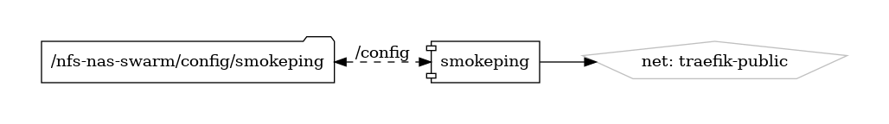

# SmokePing

Network Latency Monitoring Tool

{ loading=lazy }

[SmokePing](https://oss.oetiker.ch/smokeping/) is an open-source network latency monitoring tool designed to measure and visualize the latency and packet loss of network connections in real-time. Developed by Tobi Oetiker, the creator of RRDtool, SmokePing provides administrators with insights into network performance, helping to identify and troubleshoot connectivity issues, packet loss, and latency spikes across diverse network environments.

## Key Features

- **Latency Monitoring:** SmokePing measures and tracks latency (round-trip time) between a SmokePing server and various network targets, including hosts, routers, and switches.
- **Packet Loss Detection:** SmokePing monitors packet loss rates between network devices, alerting administrators to potential network problems and connectivity issues.
- **Interactive Graphs:** SmokePing generates interactive graphs and visualizations of latency and packet loss data over time, allowing administrators to analyze network performance trends and anomalies.
- **Customizable Alerting:** SmokePing supports customizable alerting mechanisms based on predefined thresholds or conditions, enabling proactive notification of network performance degradation or outages.
- **Extensibility:** SmokePing is extensible and customizable, with support for additional probes, plugins, and configuration options to tailor the monitoring solution to specific network environments and requirements.

## Getting Started

To get started with SmokePing, install the software package from the package repository of your Linux distribution, or download and compile it from source using the instructions provided on the [official website](https://oss.oetiker.ch/smokeping/). Once installed, configure SmokePing to monitor network targets by defining target hosts, probes, and alerting thresholds in the configuration file.

## Community and Support

Join the SmokePing community on [GitHub](https://github.com/oetiker/SmokePing) to engage with other users, report issues, contribute code, and stay informed about the latest updates and developments. Participate in community discussions, share feedback, and collaborate on improving and enhancing the SmokePing network latency monitoring tool.

Monitor network latency and packet loss with ease using SmokePing—a powerful and flexible tool for network performance monitoring and troubleshooting.


## Volumes

```bash
/swarm/config/
/swarm/data/
```

## Deployment
No Special requirments

## Docker swarm file
``` yaml linenums="1" 
--8<-- "/docs/github-repos/portainer-compose/stacks/smokeping.yml"
```

## Notes

