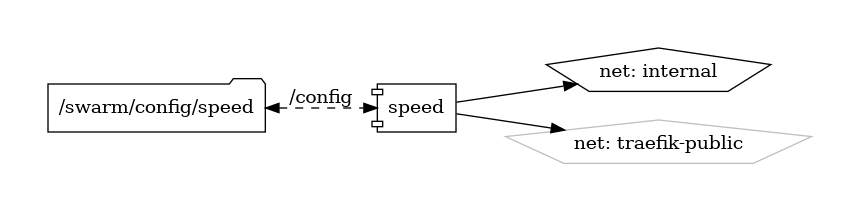

# Speedtest-Tracker

Self-Hosted Internet Performance Tracking

{ loading=lazy }

[LinuxServer/Speedtest-Tracker](https://github.com/linuxserver/speedtest-tracker) is a self-hosted internet performance tracking application that allows users to monitor their internet connection's speed and performance. Powered by Ookla's Speedtest service, Speedtest-Tracker automates speed test checks at regular intervals, providing users with insights into their network's download and upload speeds, latency, and packet loss over time.

## Key Features

- **Automated Speed Tests:** Speedtest-Tracker automatically runs speed test checks against Ookla's Speedtest service at predefined intervals, capturing real-time data on download and upload speeds, latency, and packet loss.
- **Historical Data Tracking:** Speedtest-Tracker tracks and stores historical performance data, allowing users to view trends, analyze patterns, and identify fluctuations in internet performance over time.
- **Customizable Monitoring:** Speedtest-Tracker supports customizable monitoring settings, allowing users to specify test intervals, target servers, and thresholds for performance metrics.
- **User-Friendly Dashboard:** Speedtest-Tracker provides a user-friendly web-based dashboard for viewing and visualizing speed test results, with interactive charts, graphs, and statistics for monitoring internet performance.
- **Self-Hosted Solution:** Speedtest-Tracker is a self-hosted application, giving users full control over their data and infrastructure, with support for deployment on Linux servers, Docker containers, and other hosting environments.

## Getting Started

To get started with LinuxServer/Speedtest-Tracker, visit the [GitHub repository](https://github.com/linuxserver/speedtest-tracker) for installation instructions, documentation, and resources. Follow the provided guides to deploy and configure Speedtest-Tracker on your preferred hosting environment and start monitoring your internet performance.

## Community and Support

Join the Speedtest-Tracker community on [GitHub](https://github.com/linuxserver/speedtest-tracker) to engage with other users, report issues, contribute code, and stay informed about the latest updates and developments. Participate in community discussions, share feedback, and collaborate on improving and enhancing the Speedtest-Tracker internet performance tracking application.

Monitor your internet connection's speed and performance with ease using LinuxServer/Speedtest-Tracker—a self-hosted solution for internet performance tracking powered by Ookla's Speedtest service.


## Volumes

```bash
/nfs-nas-swarm/config/
/nfs-nas-swarm/data/
```

## Deployment
No Special requirments

## Docker swarm file
``` yaml linenums="1" 
--8<-- "/docs/github-repos/portainer-compose/stacks/speed.yml"
```

## Notes

