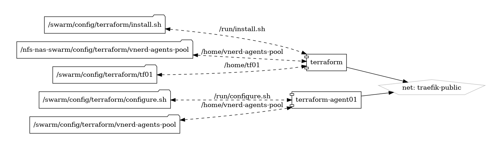

# Terraform

Infrastructure as Code (IaC) Orchestration Tool

{ loading=lazy }

[Terraform](https://www.terraform.io/) is an open-source infrastructure as code (IaC) orchestration tool created by HashiCorp. It allows users to define and provision infrastructure resources using a declarative configuration language, enabling them to manage infrastructure in a predictable and repeatable way across different cloud providers, data centers, and environments.

## Key Features

- **Declarative Configuration:** Terraform uses a declarative configuration language called HashiCorp Configuration Language (HCL) to define infrastructure resources, dependencies, and configurations, allowing users to describe the desired state of their infrastructure.
- **Infrastructure as Code:** Terraform treats infrastructure as code, enabling users to version control infrastructure configurations, collaborate on changes, and apply infrastructure changes programmatically using version control systems like Git.
- **Multi-Cloud Support:** Terraform supports multiple cloud providers, including AWS, Azure, Google Cloud Platform (GCP), and others, as well as on-premises infrastructure, enabling users to manage heterogeneous environments with a single tool.
- **Immutable Infrastructure:** Terraform promotes the concept of immutable infrastructure, where infrastructure changes are made by replacing entire resource instances rather than modifying existing instances, ensuring consistency and reproducibility.
- **Resource Graph:** Terraform builds a dependency graph of infrastructure resources based on their configurations, allowing it to determine the optimal order of resource creation, update, and destruction during provisioning and modification.

## Getting Started

To get started with Terraform, download and install the Terraform binary from the [official website](https://www.terraform.io/), and set up your development environment. Follow the provided documentation and tutorials to learn the basics of Terraform configuration, provisioning, and management.

## Community and Support

Join the Terraform community on [GitHub](https://github.com/hashicorp/terraform) to engage with other users, report issues, contribute code, and stay informed about the latest updates and developments. Participate in community discussions, share feedback, and collaborate on improving and enhancing the Terraform infrastructure as code platform.

Automate infrastructure provisioning and management with Terraform—a versatile and powerful tool for defining, provisioning, and managing infrastructure as code.


## Volumes

```bash
/swarm/config/
/swarm/data/
```

## Deployment
No Special requirments

## Docker swarm file
``` yaml linenums="1" 
--8<-- "/docs/github-repos/portainer-compose/stacks/terraform.yml"
```

## Notes

