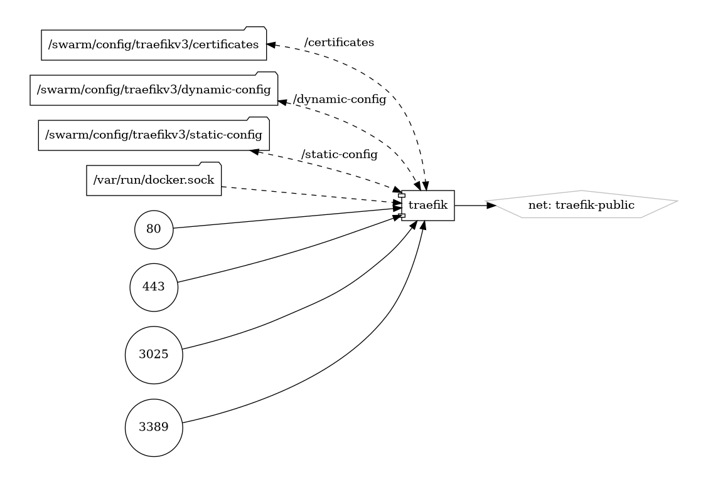

# Traefik

The Modern, Dynamic Reverse Proxy

{ loading=lazy }

[Traefik](https://traefik.io/) stands as a dynamic and modern reverse proxy and load balancer designed for effortlessly managing microservices architectures, container orchestration systems, and traditional web applications. Renowned for its simplicity, flexibility, and native integration with container orchestrators, Traefik is a go-to solution for routing and securing web traffic.

## Key Features

- **Container Native:** Traefik seamlessly integrates with container orchestrators like Docker, Kubernetes, and more, adapting dynamically to changes in your infrastructure.

- **Automatic Discovery:** With built-in support for service discovery, Traefik dynamically detects and configures itself as new services are added or removed, simplifying the management of evolving infrastructures.

- **TLS Termination:** Enhance security with Traefik's native support for TLS termination, allowing easy configuration of SSL certificates for your services.

- **Middleware and Plugins:** Extend functionality through middleware and plugins, enabling additional features such as rate limiting, authentication, and URL rewriting.

## Getting Started

Deploying Traefik is straightforward, especially in containerized environments. The Traefik documentation provides comprehensive guides and examples to help you get started quickly.

[Traefik Documentation](https://doc.traefik.io/traefik/)

## Community and Support

Join the active Traefik community to collaborate with users, share experiences, and stay informed about updates and best practices. The open-source nature of Traefik encourages community-driven development and support.

[Traefik GitHub Repository](https://github.com/traefik/traefik)

Experience the agility and simplicity of Traefik—a reverse proxy designed for the modern, dynamic world of microservices and containerized applications.


## Volumes

```bash
/swarm/config/traefik
/swarm/data/traefik
```

## Deployment
1. create an external attachable network in swarm
2. create constrains on node so the container will always be deployed on the manager node
3. create the NAT rules
4. create the firewall rules
5. deploy this stack

```bash
docker run -d -p 443:8080 -p 80:80 \
    -v $PWD/traefik.yml:/etc/traefik/traefik.yml traefik
```

The traefik.yml file:

```yaml
services:

  traefik:
    # Use the latest v2.2.x Traefik image available
    image: traefik:latest
    ports:
      # Listen on port 80, default for HTTP, necessary to redirect to HTTPS
      - 80:80
      # Listen on port 443, default for HTTPS
      - 443:443
    deploy:
      placement:
        constraints:
          # Make the traefik service run only on the node with this label
          # as the node with it has the volume for the certificates
          - node.labels.traefik-public.traefik-public-certificates == true
      labels:
        # Enable Traefik for this service, to make it available in the public network
        - traefik.enable=true
        # Use the traefik-public network (declared below)
        - traefik.docker.network=traefik-public
        # Use the custom label "traefik.constraint-label=traefik-public"
        # This public Traefik will only use services with this label
        # That way you can add other internal Traefik instances per stack if needed
        - traefik.constraint-label=traefik-public
        # admin-auth middleware with HTTP Basic auth
        # Using the environment variables USERNAME and HASHED_PASSWORD
        - traefik.http.middlewares.admin-auth.basicauth.users=admin:27eros33
        # https-redirect middleware to redirect HTTP to HTTPS
        # It can be re-used by other stacks in other Docker Compose files
        - traefik.http.middlewares.https-redirect.redirectscheme.scheme=https
        - traefik.http.middlewares.https-redirect.redirectscheme.permanent=true
        # traefik-http set up only to use the middleware to redirect to https
        # Uses the environment variable DOMAIN
        - traefik.http.routers.traefik-public-http.rule=Host(`traefik.vnerd.nl`)
        - traefik.http.routers.traefik-public-http.entrypoints=http
        - traefik.http.routers.traefik-public-http.middlewares=https-redirect
        # traefik-https the actual router using HTTPS
        # Uses the environment variable DOMAIN
        - traefik.http.routers.traefik-public-https.rule=Host(`traefik.vnerd.nl`)
        - traefik.http.routers.traefik-public-https.entrypoints=https
        - traefik.http.routers.traefik-public-https.tls=true
        # Use the special Traefik service api@internal with the web UI/Dashboard
        - traefik.http.routers.traefik-public-https.service=api@internal
        # Use the "le" (Let's Encrypt) resolver created below
        - traefik.http.routers.traefik-public-https.tls.certresolver=le
        # Enable HTTP Basic auth, using the middleware created above
        - traefik.http.routers.traefik-public-https.middlewares=admin-auth
        # Define the port inside of the Docker service to use
        - traefik.http.services.traefik-public.loadbalancer.server.port=8080
    volumes:
      # Add Docker as a mounted volume, so that Traefik can read the labels of other services
      - /var/run/docker.sock:/var/run/docker.sock:ro
      # Mount the volume to store the certificates
#      - traefik-public-certificates:/certificates
      - /swarm/config/trafiek/certificates:/certificates
    command:
      # Enable Docker in Traefik, so that it reads labels from Docker services
      - --providers.docker
      # Add a constraint to only use services with the label "traefik.constraint-label=traefik-public"
#      - --providers.docker.constraints=Label(`traefik.constraint-label`, `traefik-public`)
      # Enable Docker Swarm mode
      - --providers.docker.swarmmode
      # Create an entrypoint "http" listening on port 80
      - --entrypoints.http.address=:80
      # Create an entrypoint "https" listening on port 443
      - --entrypoints.https.address=:443
      # Create the certificate resolver "le" for Let's Encrypt, uses the environment variable EMAIL
      - --certificatesresolvers.le.acme.email=karam.ajaj@hotmail.com
      # Store the Let's Encrypt certificates in the mounted volume
      - --certificatesresolvers.le.acme.storage=/certificates/acme.json
      # Use the TLS Challenge for Let's Encrypt
      - --certificatesresolvers.le.acme.tlschallenge=true
      # Enable the access log, with HTTP requests
      - --accesslog
      # Enable the Traefik log, for configurations and errors
      - --log
      # Enable the Dashboard and API
      - --api
    networks:
      # Use the public network created to be shared between Traefik and
      # any other service that needs to be publicly available with HTTPS
      - traefik-public

#volumes:
  # Create a volume to store the certificates, there is a constraint to make sure
  # Traefik is always deployed to the same Docker node with the same volume containing
  # the HTTPS certificates
#  traefik-public-certificates:

networks:
  # Use the previously created public network "traefik-public", shared with other
  # services that need to be publicly available via this Traefik
  traefik-public:
    external: true
```

## Docker swarm file
Edit the deployment parameters, so the stack should be like this 

``` yaml linenums="1" 
--8<-- "/docs/github-repos/portainer-compose/stacks/traefik.yml"
```

## Notes