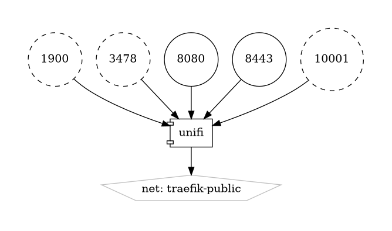

# UniFi

Integrated Network Management System

{ loading=lazy }

[UniFi](https://www.ui.com/software/) is an integrated network management system developed by Ubiquiti Networks. It provides a comprehensive suite of networking solutions, including wireless access points, switches, routers, and security gateways, designed to deliver reliable, high-performance connectivity for homes, businesses, and enterprises.

## Key Features

- **Centralized Management:** UniFi offers centralized management and configuration of network devices through the UniFi Controller software, providing administrators with a single interface to monitor and control their entire network infrastructure.
- **Scalability:** UniFi is highly scalable, supporting deployments ranging from small home networks to large enterprise environments, with support for hundreds or even thousands of devices.
- **Feature-Rich Access Points:** UniFi access points offer advanced features such as seamless roaming, band steering, and guest portal authentication, providing users with a reliable and secure wireless experience.
- **Integration with UniFi Protect and UniFi Access:** UniFi integrates with other Ubiquiti products such as UniFi Protect for video surveillance and UniFi Access for access control, enabling unified management of multiple systems through the same platform.
- **Cloud Management:** UniFi offers optional cloud-based management through the UniFi Cloud Key or UniFi Dream Machine, allowing administrators to manage their network from anywhere with an internet connection.

## Getting Started

To get started with UniFi, visit the [UniFi software page](https://www.ui.com/software/) to download the UniFi Controller software or sign up for UniFi Cloud access. Follow the provided setup guides and documentation to deploy and configure your UniFi network devices and start managing your network infrastructure.

## Community and Support

Join the UniFi community on the [Ubiquiti Community Forum](https://community.ui.com/questions) to engage with other users, ask questions, share experiences, and stay informed about the latest updates and developments. Ubiquiti also provides official support through their [support portal](https://help.ui.com/hc/en-us).

Simplify and streamline your network management with UniFi—an integrated network management system designed for homes, businesses, and enterprises.


## Volumes

```bash
/nfs-nas-swarm/config/
/nfs-nas-swarm/data/
```

## Deployment
No Special requirments

## Docker swarm file
``` yaml linenums="1" 
--8<-- "/docs/github-repos/portainer-compose/stacks/unifi.yml"
```

## Notes

