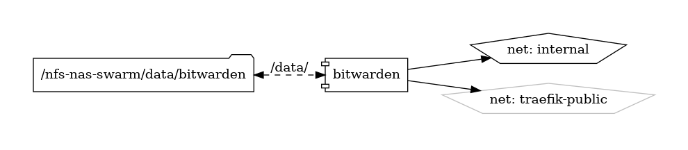

# Vaultwarden

Self-Hosted Password Manager

{ loading=lazy }

[**Vaultwarden**](https://github.com/dani-garcia/vaultwarden) is a self-hosted password manager that provides a secure and private solution for managing your sensitive credentials. Born from the open-source community, Vaultwarden is a fork of the renowned Bitwarden RS, ensuring users have full control over their password data while maintaining the familiar and intuitive Bitwarden experience.

## Key Features

- **Self-Hosted:** Vaultwarden empowers users to host their password manager, allowing complete control over the security and privacy of their sensitive information.

- **Bitwarden Compatibility:** Enjoy compatibility with Bitwarden clients, ensuring a seamless transition and a familiar user interface for managing passwords.

- **End-to-End Encryption:** Benefit from robust end-to-end encryption to secure your login credentials, ensuring they remain confidential and protected.

- **Cross-Platform Access:** Access your passwords securely from various devices using the Bitwarden clients available for desktop, mobile, and web platforms.

## Getting Started

Setting up Vaultwarden is straightforward. Dive into the [official GitHub repository](https://github.com/dani-garcia/vaultwarden) for comprehensive documentation, installation guides, and configuration details.

## Community and Support

Join the Vaultwarden community on [GitHub](https://github.com/dani-garcia/vaultwarden) to engage with other users, share insights, and stay informed about updates and enhancements. The collaborative nature of Vaultwarden ensures continuous support and improvements.

Secure your passwords with confidence using Vaultwarden—an open and self-hosted password manager designed to prioritize privacy and user control.


## Volumes

```bash
/nfs-nas-swarm/data/bitwarden
```

## Deployment
Create the following configuration files in the shared volume "config.json"
```json
{
  "domain": "https://password.vnerd.nl/",
  "sends_allowed": true,
  "incomplete_2fa_time_limit": 3,
  "disable_icon_download": false,
  "signups_allowed": false,
  "signups_verify": false,
  "signups_verify_resend_time": 3600,
  "signups_verify_resend_limit": 6,
  "invitations_allowed": true,
  "emergency_access_allowed": true,
  "password_iterations": 600000,
  "password_hints_allowed": true,
  "show_password_hint": false,
  "admin_token": "{admin-token}",
  "invitation_org_name": "password.vnerd.nl",
  "ip_header": "X-Real-IP",
  "icon_redirect_code": 302,
  "icon_cache_ttl": 2592000,
  "icon_cache_negttl": 259200,
  "icon_download_timeout": 10,
  "icon_blacklist_non_global_ips": true,
  "disable_2fa_remember": false,
  "authenticator_disable_time_drift": false,
  "require_device_email": false,
  "reload_templates": false,
  "log_timestamp_format": "%Y-%m-%d %H:%M:%S.%3f",
  "admin_session_lifetime": 20,
  "_enable_yubico": true,
  "_enable_duo": true,
  "_enable_smtp": true,
  "use_sendmail": false,
  "sendmail_command": "send",
  "smtp_host": "{smtp-host}",
  "smtp_security": "off",
  "smtp_port": {smtp-port},
  "smtp_from": "bitwarden@vnerd.nl",
  "smtp_from_name": "Vaultwarden",
  "smtp_username": "bitwarden-docker",
  "smtp_password": "{password}",
  "smtp_timeout": 15,
  "smtp_embed_images": true,
  "smtp_accept_invalid_certs": true,
  "smtp_accept_invalid_hostnames": true,
  "_enable_email_2fa": false,
  "email_token_size": 6,
  "email_expiration_time": 600,
  "email_attempts_limit": 3
}

```


## Docker swarm file
``` yaml linenums="1" 
--8<-- "/docs/github-repos/portainer-compose/stacks/vaultwarden.yml"
```

## Notes

- SIGNUPS_ALLOWED should be false, otherwise other people can sign up.

- admin_token should be generated, you can get a hash from [argon2.online](https://argon2.online/).