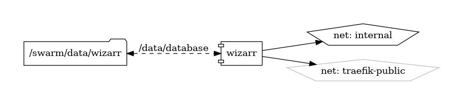

# Wizarr

Advanced User Invitation and Management System

{ loading=lazy }

[Wizarr](https://github.com/Wizarr) is an open-source user invitation and management system designed for media server platforms like Jellyfin, Plex, and Emby. It provides administrators with advanced tools for user management, invitation workflows, and access control, enabling seamless integration and management of user accounts across media server deployments.

## Key Features

- **User Invitation Workflow:** Wizarr simplifies the user invitation process by providing an intuitive interface for sending invitations to new users, allowing them to register and access the media server platform with predefined roles and permissions.
- **Role-Based Access Control:** Wizarr supports role-based access control (RBAC), allowing administrators to define custom user roles and assign granular permissions to control access to media content, libraries, and features.
- **Multi-Platform Integration:** Wizarr seamlessly integrates with popular media server platforms such as Jellyfin, Plex, and Emby, providing a unified user management solution for managing user accounts across different server deployments.
- **Customization and Extensibility:** Wizarr is highly customizable and extensible, with support for custom themes, plugins, and extensions, enabling administrators to tailor the user interface and functionality to their specific requirements and preferences.
- **Audit Logging and Reporting:** Wizarr provides audit logging and reporting features, allowing administrators to track user activities, monitor access patterns, and generate usage reports for compliance and analysis purposes.

## Getting Started

To get started with Wizarr, visit the [GitHub repository](https://github.com/Wizarr) to download and install the software, or deploy it using containerization tools like Docker. Follow the provided documentation and setup guides to configure Wizarr for your media server platform and integrate it with your existing user management workflows.

## Community and Support

Join the Wizarr community on [GitHub](https://github.com/Wizarr) to engage with other users, report issues, contribute code, and stay informed about the latest updates and developments. Participate in community discussions, share feedback, and collaborate on improving and enhancing the Wizarr user invitation and management system.

Streamline user management for your media server platform with Wizarr—an advanced user invitation and management solution designed for Jellyfin, Plex, Emby, and more.


## Volumes

```bash
/swarm/config/
/swarm/data/
```

## Deployment
No Special requirments

## Docker swarm file
``` yaml linenums="1" 
--8<-- "/docs/github-repos/portainer-compose/stacks/wizarr.yml"
```

## Notes

