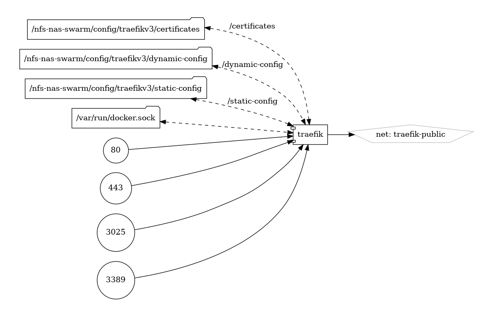

# Deploying Traefik in a Docker Swarm Cluster


---

### Prerequisites

Before deploying Traefik, ensure you have the following:

- A functioning Docker Swarm cluster.
- Docker Compose installed for stack configuration.
- Basic understanding of Docker Swarm and networking.

---

### Traefik Stack Deployment

Deploying Traefik as a stack in your Docker Swarm cluster involves creating a Docker Compose file and deploying it using Docker Swarm.

#### steps

1. create an external attachable network in swarm
2. create constrains on node so the container will always be deployed on the manager node
3. create the NAT rules
4. create the firewall rules
5. deploy this stack

```bash
docker run -d -p 443:8080 -p 80:80 \
    -v $PWD/traefik.yml:/etc/traefik/traefik.yml traefik
```

---

### Traefik Stack Diagram

{ loading=lazy }

---
### Docker Compose File
   Define the Traefik service with necessary configurations.
   
``` yaml linenums="1" 
--8<-- "/docs/github-repos/portainer-compose/stacks/traefikv3.yml"
```

---